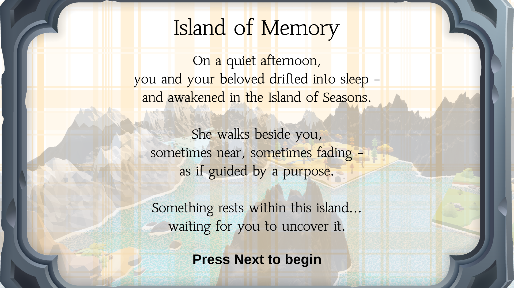
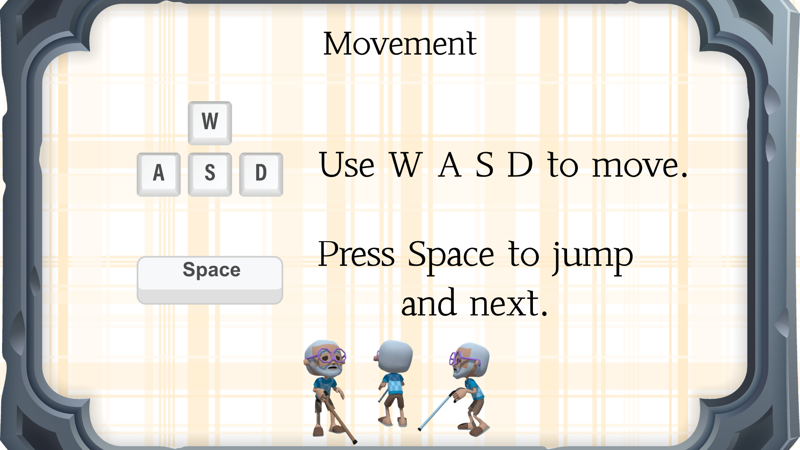

# 🌊 Islands of Memory

> A 3D Narrative Exploration Prototype  
> CMP-6056B Game and Mobile App Development  
> University of East Anglia

---

## 📖 Overview

**Islands of Memory** is a 3D narrative exploration game prototype developed in Unity.

The game follows an elderly protagonist who enters a dream world known as the *Four Seasonal Islands* after falling asleep beside their beloved. Within this symbolic world, fragments of memories are scattered across different lands.

Players explore calm environments, travel by boat, collect memory puzzle fragments, and gradually reconstruct a shared lifetime of love.

This repository represents the first playable vertical slice of the project.

---

## 🌅 Story Background

  

You and your beloved fall asleep together on a quiet afternoon, entering a dream world — the Islands of Memory.

Your beloved appears and disappears throughout the journey, guiding you toward something unknown.

Hidden within the islands are fragments of memories, waiting to be discovered and restored.

---

## 🎮 Controls Tutorial

  

| Key | Action |
|------|--------|
| W A S D | Movement |
| Space | Jump |
| E | Interact (Board / Disembark / Collect) |
| A / D (Boat Mode) | Row left / right oars |
| Space (Intro) | Next slide |

---

## 🎮 Core Gameplay Loop

1. Narrative introduction (slide-based system)
2. Free exploration using WASD
3. Boat boarding interaction (Press **E**)
4. Alternating rowing mechanic (**A / D**)
5. Contextual zone hint system
6. Dock arrival and conditional disembark
7. Puzzle fragment collection
8. Puzzle progress update

This forms the first complete emotional and mechanical loop of the game.

---

## 🧩 Implemented Systems

### 🚤 Boat Boarding System
- Trigger-based boarding detection
- Conditional exit only at dock zones
- Camera transition between walk and boat modes
- DockZone-based exit logic

### 🗺 Zone Hint System
- Trigger-based contextual text display
- World-space UI anchored to boat
- Optional inspector-based color override
- Boat-only trigger detection logic

### 🧩 Puzzle Pickup System
- Trigger-based collectible interaction
- Puzzle indexing system
- UI progress integration

### 📖 Intro Flow System
- PNG slide-based introduction
- Space-key navigation
- Controlled gameplay start

### 🎵 Audio System
- Global background music
- Emotion-driven atmosphere design

---

## 🎨 Visual Style

- Low-poly stylised 3D environment
- Minimalist UI design
- Soft seasonal colour palette
- Calm exploration-focused presentation
- Symbolic emotional storytelling

---

## 🏗 Built With

- Unity (URP)
- C#
- TextMeshPro
- World Space UI
- Custom interaction scripts

---

## 🎯 Target Audience

- Players who enjoy calm exploration games
- Narrative-driven experiences
- Emotional and reflective gameplay
- Symbolic mechanics and environmental storytelling

---

## 🚀 Prototype Scope (Coursework 1)

This prototype includes:

- Fully functional interaction systems
- A complete playable vertical slice
- Boat navigation mechanics
- Conditional disembark system
- Puzzle collection system
- Narrative introduction flow

Future development will expand to:

- Four seasonal islands
- Advanced puzzle reconstruction mechanics
- Emotional narrative progression
- Final memory completion sequence

---

## 🎥 Demo Video

YouTube (Unlisted):  
https://youtu.be/zsJpYRZA080

---

## 👤 Author

Chenxu Yang  
University of East Anglia  
Student ID: 100512107
